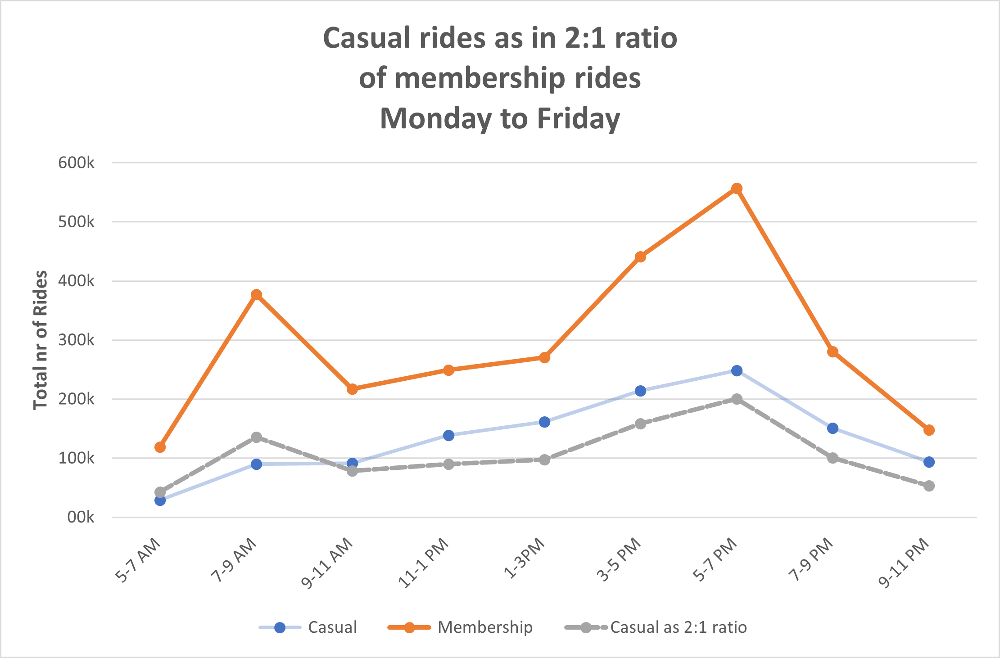

```{r functions, message = FALSE, warnings = FALSE, echo = FALSE}
#Importing libraries and data
library(tidyverse)
library(readxl)
library(ggplot2)
library(googledrive)
library(scales)
library(knitr)

bike_df <- read.csv("bike_df.csv")
```

# R Markdown: A bike-share project

**Cyclistic bike-share** is a bike-sharing company in Chicago that aims to make riding a bike more convenient and accessible.
This case study aims to analyse the previous 12 months of data (Oct/23-Sept/24) and to find any valuable insights.
Bellow, through a series of charts and statistics, I will try to decipher if the **casual riders can be converted into members** and find any similar behavior between the two.

### Key informations

1. **Fleet**: _5824_ bikes across _692_ docking stations.
2.  In the last 12 months there were about 5.7 million rides from which we find the following type of riders:
 + 8% choose assistive option bikes;
 + 92% of riders choose traditional 2 wheel bikes;
 + 30% commute to work;
 + 70% use for leisure.

*GOAL*: **Figuring out if there is an opportunity for future growth on converting casual into membership riders**. Here we have a *few key aspects*:   
1. Company had a steady success over the years by relying on building awareness and appealing to broad consumer segments.   
2. *The strategy*: making the pricing more flexible with:   
 + _single-ride passes,_    
 + _full-day passes,_    
 + _annual memberships._   
3.  _Casual riders_ already know about the Cyclistic`s program and they _have chosen Cyclistic for_ their _mobility_ needs.     


## Insigths about the distribution of monthly rides 

* **Summer months have significantly more rides then the rest of the year, regardless the plan.**   
Here is the chart:      


  
We notice a huge difference between the number of rides taken in the summer months vs winter months. We do expect this, given the cold winter (for more info about Chicago's weather, [click here](https://en.climate-data.org/north-america/united-states-of-america/illinois/chicago-1574/)), however, we notice that the number of rides decreases quite at a steep rate between October **(537k)** and December **(224k)**. That`s more than 50% less within 2 months.     

 Its worth noticing that the **percentage ratio between membership and casual rides is roughly 2:1**. 


* The percentage ratio varies upon the month with the casual percentage being higher in the summer. (**43% in July vs 17% in January**) See bellow:      


  
 It seems that the **casual riders mostly prefer warmer months** so the annual plan might not work for at least some of them.     
*!!! Maybe a 3 months or 6 months membership might be a way to convert them.*     
 The question is:     
 **What percentage of the casual riders are most likely to convert into membership plan?**

## Insigths about the distribution of rides for every day of the week

 If we zoom in and look at number of rides per week day, we notice something interesting:     

```{r, flipper vs mass, message = FALSE, warnings = FALSE, echo=FALSE}
total_rides <- bike_df %>%
  group_by(day_of_week, member_casual) %>%
  summarise(weekly_ride_count = n(), .groups = 'drop') %>%
  group_by(day_of_week, member_casual) %>%
  summarise(ride_count = sum(weekly_ride_count), .groups = 'drop')

ggplot(total_rides, plot = plot, width = 8, height = 6, aes(x = day_of_week, y = ride_count, fill = member_casual)) +
  geom_bar(stat = "identity", position = "dodge") +
  labs(
    title = "Total Number of Rides per Day of the Week by Membership Type",
    x = "Day of the Week",
    y = "Number of Rides",
    fill = "Membership Type"
  ) +
  scale_y_continuous(labels = comma)+
  scale_x_discrete(limits = c("Sunday", "Monday", "Tuesday", "Wednesday", 
                              "Thursday", "Friday", "Saturday"))+
  scale_fill_manual(values = c("orange", "lightblue")) +
  theme(
    axis.text.x = element_text(angle = 45, hjust = 1)
  )
```

 Few things we notice here:    
* Casual riders tend to cycle more in the weekends.    
* Cannot say the same thing for members, where most of the rides occur consistently between Monday and Friday with the peak in the mid-week.    
* No matter the day, the number of membership rides exceed that of casual rides. However, on weekends, the numbers get very close.    

**Takes:** It seems that the casual riders that use the bike during the week might represent *our target* since we have very consistent number and most likely some of them use Cyclistic to commute to work. If its the case, they might consider switching to a membership plan.      
 The percentage is quite small though, about *20-22%* of all rides or **60%** of all casual rides.    

## Will the distribution of electric vs classic bikes tell us a story?

 It seems that the distribution between electric and classic bike rides is very close, with
electric bikes having a little bit over 50% (*50.6%*).  

```{r, Distributio_electric_classic, message = FALSE, warnings = FALSE, echo=FALSE}
total <- nrow(bike_df)
electric_classic <- bike_df %>%
  group_by(rideable_type) %>%
  summarise(rides_count = prettyNum(n(), big.mark = ","),
            percentages = sprintf("%.2f%%", (n() / total) * 100))
kable(electric_classic, caption = "Electric vs Classic")
```

Even when we look at the distribution of bikes according to the plan chosen, the percentage is still almost evenly as seen below.


 However, I have noticed a few compelling insights, when looking at the average length of the trips taken (electric vs classic). I will explore these in the following chapter.

### Average trip length

Overall, the average length for casual riders is nearly double that of membership.


  
 Things become interesting when looking at the difference between the bike type and the plan chosen.


We see the followings:     
1. Casual riders that use **classic bikes** mostly use the bike for leisure purposes given the longer trips.     
2. Casual riders that use **electric bikes** have an average trip length nearly 3 times shorter.  

*Conclusion:* Its safe to assume that the **casual riders who rent a bike, specifically to get to a destination(work, school, shopping, etc) will prefer an electric bike.**     

*If we increase the number of electric bikes, there is a possibility that at least some of the casual riders that need a short ride will be incentivise to rent a bike more often to the point where a membership plan might be a viable option for them.*

## Ride lengths

 Let`s have a look at a chart that tells us the most common trip length between casual and membership.
 


**Few observations:**     
1. Most rides have a length between 5 and 30 minutes, so its safe to say that these rides have a mainly purpose to get the rider to a destination and nothing else.     
2. If the members prefer time frames between 2 and 30 minutes, **casual riders prefer time frames between 5 min and 2 hours** with a majority falling in the 5-30 minutes trip length (that`s about *25% of the total rides*).  

 **Casual riders use the bike for longer periods of time.**    

 *The casual riders who fall into 5-30 minutes trip length should represent out target. The rest we ignore, since trips longer than 30 minute are mostly for leisure purposes.*

 **Our plan is to look at these 1.33 million (23% of all rides) casual  rides and see which ones can be converted into membership plan**. In addition, out of 1.33 million, about 60% are using electric bikes.

## Distribution of rides throughout the week days of Monday-Friday

 The last point I want to bring up is the distribution of total rides within a day. Since a lot of riders use Cyclistic for work commute, We should see spikes around the rush hours for both casual and membership.


Let`s present the finding:   
1. I did expect to see spikes in the "rush hours" but somehow I expected to see this pattern regardless the plan chosen. However, this is what I noticed:         
 + Looking at the membership trend line, we clearly see that many riders use the bike to go to work and even more to come back home;    
 + The above behavior is partially present in the casual trend line, where the number of rides increases slowly throughout the day, with the peak between 5-7 pm, which suggests that some casual riders use the bike to ride home from work.    
2. If we have to respect the 2:1 ration between casual and membership, the casual line should look like this (See the dashed line):    



 As seen in the above line chart, the dashed line  represent the exact 2:1 ratio between the 2 plans and we do clearly miss the morning peak from our real casual trend line. Additionally, the line is always lower than the real casual line, except the morning rush hour.      
3. More casual riders ride in the weekend and surprisingly in the night. This is the first metric where the number of casual riders is bigger than that of membership (86k vs 82k). This metric accounts for all number of rides within a year, between 12 midnight and 5 am.      

## Final thoughts

 I guess the real question that Lily Moreno is asking is whatever we see any similarities between the behavior of the casual and membership riders. If we find significant number of casual riders that present the same pattern and the same behavior as the membership ones, marketing this segment of riders would be a wise decision.       
 However, I am afraid that the charts and the numbers tell us a different story.       
 It seems that there are a few key differences between the casual and members when looking at the behavior and the patterns found within my analysis.    
 These are:     
* Casual riders clearly prefer the warmer months.     
* They also rent a bike more often in the weekends.    
* They tend to use the bike for longer periods of time(mainly leisure purposes).    
* Despite the fact that the most common trip length is between 5-30 min, a significant portion falls in the 30 min-2 hours journey length (~17%).    
* The number of casual rides within a day does not seem to be affected by the rush hours the same way the membership is.    
* A large number of casual riders use the bike outside this Monday-Friday daytime frame (weekends and the nights).     
 
**How can we figure it out if the casual riders can be converted by looking at the charts and the numbers?**   
Realistically, in order for the casual riders to find any value in the annual plan, we should see similarities between the casual and membership metrics and the truth is...there isn`t much.   
Since, the casual riders mainly ride in the weekends and summer, annual plan is really not appealing.    
Out of all casual riders, those who might consider switching to an annual plan are those who use the bike frequent and consistent during Monday-Friday for non-leisure purposes.
Furthermore, the number of casual rides who fit the annual plan (Monday-Friday time frame and 5-30 min trip length is ~800k (merely 14% of all rides). If we take in consideration the time of the day to match the rush our, the percentage is even lower (3-4%).    
Technically, only 3 to 4% of all casual riders use the bike within the rush hour. Presumably, to commute to work. I believe this segment is the easiest to convert since they rent a bike very often.   

### Other ideas

Here are some alternative ideas:   
1. Creating more and appealing membership plans such:   
 + Since the number of casual riders that use the bike non-frequent and seasonal is quite big, a 3 or 6 months membership could be a way to attract them.   
 + A week pass (Monday-Friday) is an alternative for the week riders (we know at least 3% fit in this category).      
2. Just keep the current strategy by bringing more awareness and increase the number of non-conventional  bike.    
3. Increase the number of electric bikes. This could be a way to attract more riders in the winter season where riders want quicker journeys and easy riding experience.    

*Final note*  
All the charts and conclusions are not 100% accurate since there are many variables which are missing such as the age of the riders, the people who commute to work in the weekends or nights, those who don`t live in Chicago, etc.    
However, from the data that I was given, this analysis should give a clear and accurate image of what is happening behind the sheets and the numbers.


